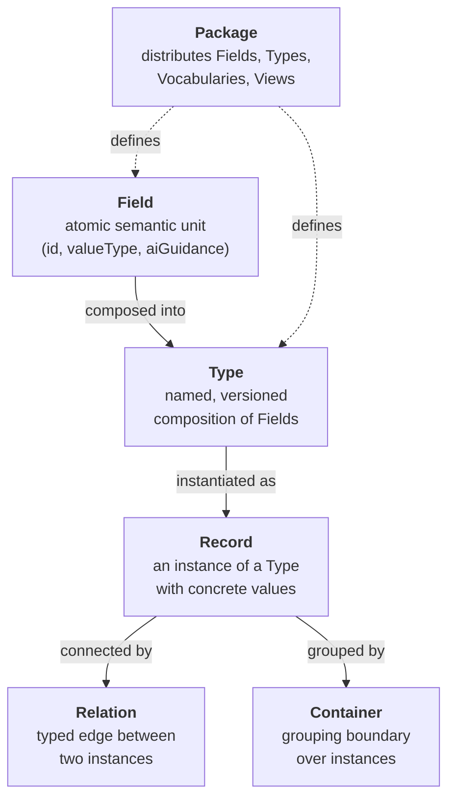
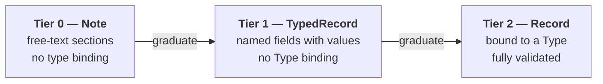
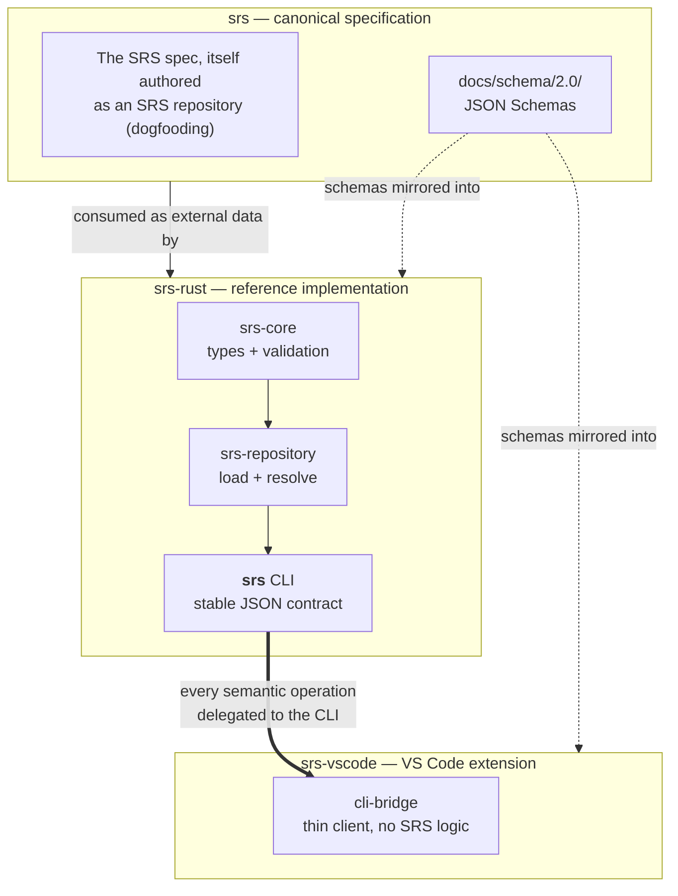

# SRS — The Big Picture

> **New here? Start with this page**, then read [concepts.md](concepts.md) for the key
> elements and [how-it-works.md](how-it-works.md) for how the pieces fit together and
> how the tooling is built. For the normative detail, go to the
> [specification](../spec/srs-spec.md).

## What is SRS?

**SRS (Semantic Record System) is a structured data model for authoring and managing
*semantic records*** — typed, versioned, addressable pieces of information that can be
composed, related, rendered, and validated by tooling.

Most documents are a wall of text that only a human can interpret. SRS instead breaks
information into small, named, machine-understandable units and records how they relate.
A paragraph of prose becomes a **Record** of one or more **Fields**, each Field carrying
explicit semantics (a stable identity, a value type, and guidance for AI). Records connect
to each other through first-class **Relations**. The result is information a tool can
query, validate, re-render, and reason over — not just display.

The defining principle of the whole system:

> **Records are the source of truth. Rendered documents (Markdown, HTML, …) are
> projections of those records — derived, never authoritative.**

You edit the structured records; the human-readable document is regenerated from them.

## The mental model in one picture

A handful of constructs do all the work. **Fields** are the atoms; **Types** compose them;
**Records** are instances with real values; **Relations** wire records together into a
graph; **Containers** draw grouping boundaries; **Packages** are how Field and Type
definitions are distributed. Controlled values (tags, lifecycle states, dropdown options)
all sit on one shared **Vocabulary** substrate. Optional **Extensions** layer on extra
capability without changing the core. Each of these is explained in
[concepts.md](concepts.md).

## Semantic maturity: three tiers

Not all information starts out structured. SRS lets a record grow up over time, from raw
text to fully typed data, without forcing premature structure:

Capture a rough idea as a **Note**, give it named fields when the shape emerges
(**TypedRecord**), then bind it to a published **Type** when it's ready to be validated and
shared (**Record**). Nothing is lost on the way up.

## How the project is built (three repositories)

The SemanticOps monorepo is three independent git repositories that play distinct roles:

- **`srs/`** — the canonical specification. It is *itself* an SRS repository, so the spec
  is the system's own first and largest example (dogfooding). It also owns the JSON
  Schemas under `docs/schema/2.0/`.
- **`srs-rust/`** — the reference implementation. The **`srs` CLI is the stable,
  machine-facing contract**; everything else (including the VS Code extension) talks to it.
  Internally: `srs-core` (pure types + validation, no I/O) → `srs-repository` (loading and
  reference resolution) → `srs-cli` (the binary, JSON output).
- **`srs-vscode/`** — a thin TypeScript client. It re-implements no SRS logic; it shells
  out to the `srs` CLI for every operation.

The JSON Schemas are authored once in `srs/` and mirrored into the other two repos so all
three agree on the data shapes.

## Where to go next

| If you want to… | Read |
|---|---|
| Understand each construct in detail | [concepts.md](concepts.md) |
| See how records load, validate, and render | [how-it-works.md](how-it-works.md) |
| Read the normative specification | [../spec/srs-spec.md](../spec/srs-spec.md) |
| Understand the design rationale | [../spec/srs-rationale.md](../spec/srs-rationale.md) |
| Work with SRS data as an agent (CLI rules) | `srs-usage.md` (repo root) |
