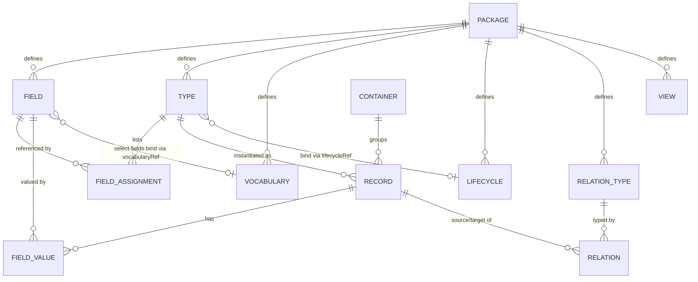
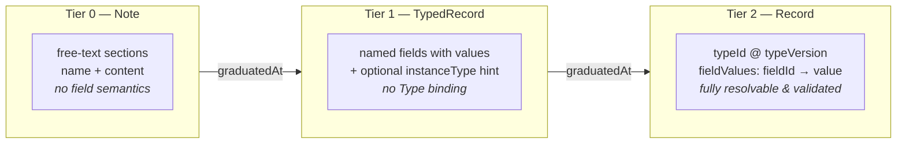
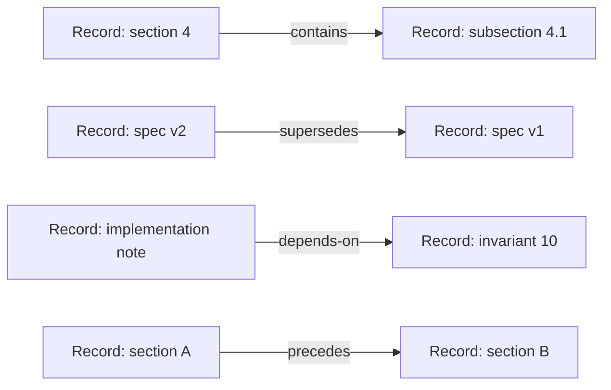
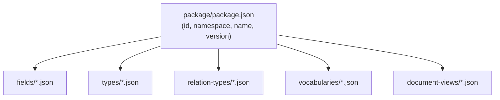
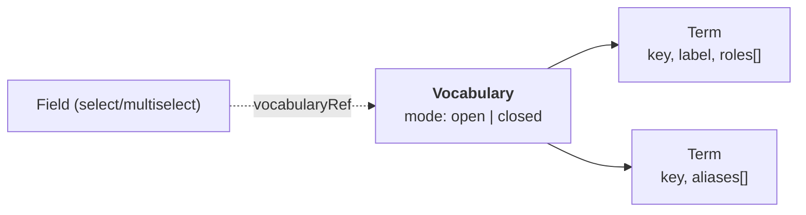
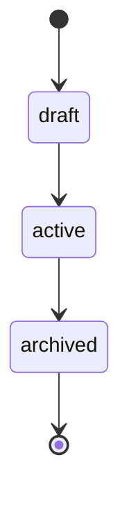

# SRS — Key Elements

This page defines the core constructs of SRS and shows how they relate. It assumes you've
read [the big picture](README.md). For normative rules, see the
[specification](../spec/srs-spec.md).

## The data model at a glance

Read it as: a **Package** distributes definitions; a **Type** is built from **Fields**
(via FieldAssignments); a **Record** instantiates a Type and holds **FieldValues**;
**Relations** (typed by a RelationType) connect Records; **Containers** group them; and
controlled values come from shared **Vocabularies** and **Lifecycles**.

---

## Field — the atomic semantic unit

A **Field** is the smallest unit of meaning. It has a stable UUID `id`, a `namespace`, a
snake_case `name`, an integer `version`, a `valueType`, and optional `aiGuidance` (a hint
that tells an AI how to extract or generate the value).

`valueType` is one of: `string`, `text`, `number`, `boolean`, `date`, `url`, `select`,
`multiselect`.

**Field semantics are immutable.** When a Field is used inside a Type, the Type cannot
override what the Field *means* — only how it's labelled for display. This guarantees that
the same Field means the same thing everywhere it appears.

> Canonical form for any definition: `namespace/name@version`
> — e.g. `com.semanticops.srs/meta.section@1`.

## Type — a composition of Fields

A **Type** is a named, versioned bundle of Fields. It declares `fields[]` as
*FieldAssignments*, each pointing at a Field by `fieldId` and adding placement metadata:
`order`, `required`, and an optional `displayLabel`.

`displayLabel` (and other display hints) are **rendering-only — they never change
semantics**. Two Records of the same Type always carry the same Field meanings regardless
of how they're labelled in a view.

## Record — an instance, in three tiers

A **Record** is concrete information. SRS recognises three tiers of semantic maturity, so
information can be captured loosely and tightened over time:

- **Tier 0 — Note**: free-text `sections[]` (each a name + content). No type binding, no
  field semantics. Good for raw capture and brainstorming.
- **Tier 1 — TypedRecord**: named fields that carry values and value types, but with no
  binding to a published Type. A lightweight `instanceType` string can hint at intent.
- **Tier 2 — Record**: bound to a specific `typeId` + `typeVersion`, with `fieldValues[]`
  mapping each `fieldId` to a value. This is the fully semantic, validatable tier.

A Tier-2 Record also carries denormalized `typeNamespace`/`typeName` hints. **If those
conflict with the resolved Type, the `typeId` wins and the Record is invalid** — the UUID
is always authoritative.

When a Type publishes a new version, existing Records are **not** auto-migrated. You create
a successor Record bound to the new version and link it back with a `supersedes` or
`refines` Relation, preserving the original.

## Relation — a typed edge between instances

A **Relation** is a first-class, typed edge between two instance UUIDs. It is a *semantic
claim*, not an ownership or lifecycle change.

The canonical relation types (defined in the core package, each carrying a `key`,
`category`, `canonicalDirection`, and optional `inverseType`):

| `key` | Meaning |
|---|---|
| `contains` | Source is composed of / contains the target (inverse: `part-of`) |
| `depends-on` | Source requires the target to be complete |
| `precedes` | Source comes before the target in sequence (inverse: `follows`) |
| `supersedes` | Source replaces / obsoletes the target |
| `refines` | Source clarifies / improves the target |
| `derived-from` | Source originates from the target |
| `evidences` | Source provides evidence for the target |

Relations live in their own file (`relations/relations.json`), separate from the records.
Ordering relations such as `precedes`/`section-sequence` use `members[]` arrays to impose
document order; point-to-point relations use `from`/`to`.

## Container — a grouping boundary

A **Container** is a lightweight boundary that groups instances (for example, "all records
implementing RFC-001"). Membership is expressed either by `rootInstanceIds` (derive the
set by traversing `contains` relations) or by an explicit `memberInstanceIds` list.

A Container's `containerId` is a distinct kind of identifier: **it must never appear as the
source or target of a Relation.** Containers organise; they don't participate in the
semantic graph.

## Package — how definitions are distributed

A **Package** declares all the Field and Type definitions (plus Vocabularies, Lifecycles,
relation types, and Views) that a repository consumes. It's the unit of distribution: an
index (`package/package.json`) pointing at individual definition files.

## Vocabulary & Term — the controlled-value substrate

Anywhere SRS needs a *controlled set of values* — tags, `select`/`multiselect` options,
relation types, lifecycle states — it uses one unified **vocabulary substrate**
(introduced by RFC-006). This replaced several earlier, divergent mechanisms with a single
model.

A **Vocabulary** is a named, versioned set of **Term** entries:

- `mode: "open" | "closed"` — a *closed* vocabulary is authoritative (only its terms are
  valid); an *open* vocabulary is usage-authoritative (new values are allowed and the
  vocabulary records what's been used).
- It can extend another vocabulary (`extendsVocabularyId`/`Version`) and supports an
  open→closed `promotionWindow`.

A **Term** carries a stable `id`, the unified `key`, a `label`, optional `description`,
`aliases[]`, `roles[]`, an optional `status`, and a `properties{}` bag for structured
extension.

A `select`/`multiselect` Field binds to a vocabulary via `vocabularyRef` (instead of an
inline `selectOptions` list), so option sets become named, shareable, and versioned.

> **Supersedes (RFC-006):** `TagDefinition` → **`Term`**; `tagKey` → **`key`**; inline
> `selectOptions` → **`vocabularyRef`**; inline `Type.lifecycle` → **`lifecycleRef`**.
> The legacy `tag-definition` package type has been retired; `Term`/`Vocabulary`
> is the model going forward.

## Lifecycle — state machines as a closed vocabulary

A **Lifecycle** is a specialised *closed* vocabulary of states plus the transitions
between them — e.g. `draft → active → archived`. It has `states[]` (each a vocabulary
entry with `isInitial`/`isFinal` flags), `transitions[]` (directed `from`→`to` edges),
and an `initialState`. Types opt in via `lifecycleRef`, so the same state machine can be
shared across many Types instead of copy-pasted.

## Extension — opt-in capability modules

The constructs above are the stable core. Everything else is an **Extension**: an
independently adoptable capability module, declared in a repository's manifest under
`declaredExtensions`. A repository turns on only what it needs.

| Extension | Adds |
|---|---|
| `ext:lifecycle` | State machines on Types; lifecycle state on Records |
| `ext:repository` | The file-based repo layout (the `.srs/` marker, `manifest.json`) |
| `ext:views-l1` / `ext:views-l2` | View rendering; document views with navigation |
| `ext:themes-l1` | Visual theming for rendered views |
| `ext:addressability` | Universal addressing across document / process / conversation spaces |
| `ext:protocol` | Structured facilitation processes with ordered stages |
| `ext:federation` / `ext:registry` / `ext:import-tracking` | Cross-repository relations, catalogs, and provenance |
| `ext:repeatable-fields` | Array values for a Field |
| `ext:field-groups` / `ext:cross-field-validation` | Grouping and multi-field validation rules |
| `ext:type-inheritance` | Types extending other Types |
| `ext:json-store` | Arbitrary JSON alongside standard fields |

See [how-it-works.md](how-it-works.md) for how these are loaded and validated, and the
[specification](../spec/srs-spec.md) for the normative definition of each.
