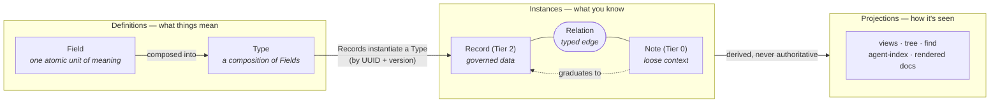
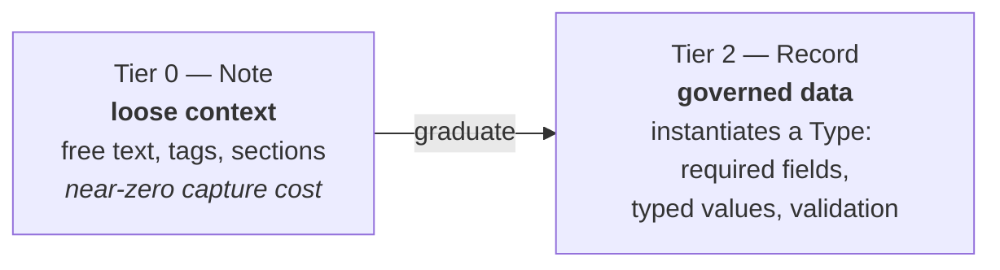
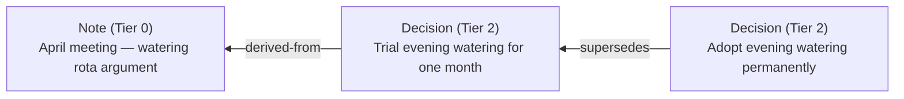
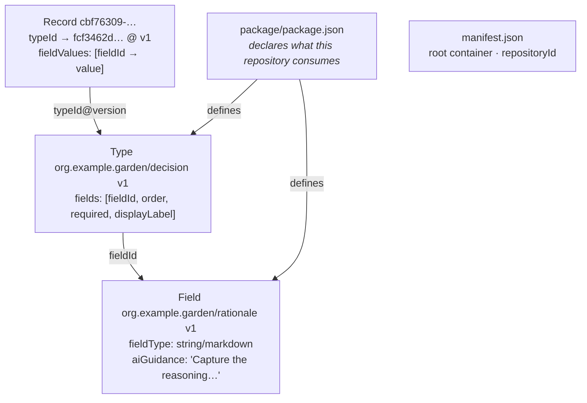

# SRS — Your First Repository

This is a doing-guide. The [big picture](README.md) tells you what SRS is and
[concepts.md](concepts.md) defines every construct; this page instead **builds a real
repository for a real purpose**, one command at a time, and lets each first principle
introduce itself at the moment you need it.

You need the `srs` CLI on your path. Everything below also works through the MCP server
(`srs mcp serve`) if you are steering an AI agent — the tools mirror the commands — but this
guide assumes a human at the keyboard who wants to understand the system, not just operate it.

Every command shown here was run against a real binary; outputs are lightly trimmed. Your
UUIDs will differ — they are generated fresh for every repository, and that is the point:
identity in SRS is never positional, never a filename, never "row 3".

---

## The idea in one diagram

SRS separates three questions that most tools tangle together: **what does this mean?**
(definitions), **what do we know?** (instances), and **how should it look?** (projections).



Definitions give meaning. Instances hold knowledge. Projections are **derived, never
authoritative** — the records are the source of truth, and everything you render from them
is a view you can regenerate.

Hold onto that; the rest is walking it.

---

## The purpose

The Riverside Community Garden is a small group that makes decisions the way most groups
do: in meetings, remembered differently by everyone who was there. We are going to give
them a **decision log** — a repository where decisions are captured with their reasoning,
where an incomplete decision cannot be logged half-formed, and where the whole history
stays legible to a newcomer (or an AI assistant) years later.

That is a deliberately governance-shaped purpose, because it exercises the thing SRS
exists to do: hold **loose human context** and **governed data** in one portable place,
and provide the ladder between them.

## Step 1 — Create the repository

```bash
srs repo create --repo ./garden \
    --namespace org.example.garden \
    --title "Riverside Community Garden"
```

```json
{
  "ok": true,
  "payload": {
    "repositoryId": "0aa4cd58-53d5-46b2-aa6d-13a2ac97385a",
    "identityInstanceId": "a01c1e1e-ac1b-4aee-ae31-e67b91787561",
    "packageId": "67dd4c3b-6f17-4906-8ed1-6409a5e38c4a"
  }
}
```

Look at what appeared on disk:

```text
garden/
├── .srs/                          ← marker: "this directory is an SRS repository"
├── manifest.json                  ← what belongs here, and who this repository is
├── package/package.json           ← definitions this repository consumes (empty so far)
├── containers/riverside-….json    ← the root container: navigation starts here
└── records/tier-2/purpose-….json  ← the identity record: why this repository exists
```

**First principle: sovereignty is structural, not aspirational.** This is a folder. There
is no server, no account, no service that has to stay in business. Copy the folder and you
have copied the repository — definitions, data, identity and all. The `repositoryId` you
see above never changes, even when the folder is copied or renamed.

Notice also that the very first record in every new repository is a **purpose** record —
the repository states why it exists before it holds anything else. You are reading a guide
that practises this: the SRS specification repository's own identity record states *its*
purpose the same way.

## Step 2 — Capture context first (Tier 0)

The April meeting happened. Nobody agreed to a schema before arguing about watering. That
is normal, and SRS meets it where it is — as a **Note**: titled, tagged, sectioned free
text with a stable identity and *no* type binding.

```bash
srs note create --repo ./garden <<'EOF'
{
  "title": "April meeting — watering rota argument",
  "sections": [
    { "name": "body", "label": "Body", "content": "Long discussion about the watering rota. Sam says evening watering wastes less water; Priya wants mornings because of the slug problem. We agreed to trial evening watering for one month and revisit in May. Also: the shed lock is broken again." }
  ],
  "tags": ["meeting", "watering"]
}
EOF
```

```json
{ "ok": true, "payload": { "note": { "instanceId": "a6395283-f4f9-4727-a09e-220faa5f5858", … } } }
```

**First principle: the cost of capture must be near zero.** A Note asks nothing of you —
no fields, no types, no ceremony. This matters more than it looks: formats that demand
structure up front lose the context that never gets entered. Tier 0 is SRS's answer to
the loose-context formats (Obsidian-style vaults, Google's OKF — see the
[landscape research](../research/semantic-document-landscape.md)): match their near-zero
adoption cost at the bottom of the ladder, so the knowledge actually arrives. What those
formats don't have is everything above Tier 0 — which is where we go next.

## Step 3 — Define what a "decision" means (Fields)

Before the group can *log* decisions, someone has to say what a decision **is**. In SRS,
meaning is built from **Fields** — each one an atomic, reusable unit: a stable UUID, a
name, a typed value shape, and guidance for both humans and AI.

```bash
srs field create --repo ./garden <<'EOF'
{
  "namespace": "org.example.garden",
  "name": "decision_statement",
  "version": 1,
  "description": "The decision itself, stated as a single actionable sentence.",
  "aiGuidance": { "purpose": "State what was decided, not the discussion that led to it. One sentence, active voice." },
  "fieldType": { "datatype": "string", "format": "plain" }
}
EOF
```

Two more the same way: `rationale` (markdown text — *why* the group decided, the trade-off
that was weighed) and `review_by` (a date — decisions in this group are trials until
reviewed). Each returns its UUID; ours came back as:

| Field | UUID |
|---|---|
| `decision_statement` | `3372a31d-865f-4c4e-a508-011dcc947cd7` |
| `rationale` | `50c54afd-fc3b-446c-87b9-61b3cff9e8ab` |
| `review_by` | `5e72a17f-da23-4785-bfbb-930c17975945` |

**First principle: semantics are immutable and identity is forever.** A Field's meaning
belongs to the Field — no Type that uses it can override what it means. And the UUID is
the identity: you can share `rationale` with another group, and their `rationale` *is*
yours, verifiably, because the UUID travels with it. This is what makes definitions
shareable between communities without a central registry deciding who owns the word.

Notice `aiGuidance`. It is part of the definition, not documentation bolted on. When an
AI assistant helps fill in a decision record, the guidance on `decision_statement` — *one
sentence, active voice, not the discussion* — travels wherever the Field goes.

## Step 4 — Compose Fields into a Type

```bash
srs type create --repo ./garden <<'EOF'
{
  "namespace": "org.example.garden",
  "name": "decision",
  "version": 1,
  "description": "A decision made by the garden group: what was decided, why, and when to revisit it.",
  "semanticObjectType": "decision",
  "aiGuidance": { "purpose": "Match records of group decisions. The statement is the decision itself; discussion belongs in notes, not here." },
  "fields": [
    { "fieldId": "3372a31d-865f-4c4e-a508-011dcc947cd7", "order": 0, "required": true,  "displayLabel": "Decision" },
    { "fieldId": "50c54afd-fc3b-446c-87b9-61b3cff9e8ab", "order": 1, "required": true,  "displayLabel": "Why" },
    { "fieldId": "5e72a17f-da23-4785-bfbb-930c17975945", "order": 2, "required": false, "displayLabel": "Review by" }
  ]
}
EOF
```

A **Type** is a named, versioned composition of Fields — which fields, in what order,
which ones are *required*. Note what the Type adds and what it doesn't: it decides
`required` and a display label per context, but it cannot touch what `rationale`
*means*. Composition without override.

The `required: true` entries are the group's own governance choice, encoded where it can
actually bite: **a decision without its reasoning cannot be logged here.** Nobody enforces
this in a meeting; the structure enforces it at the moment of writing. That is what
"governed data" means in SRS — the rules live in the definitions the group itself owns,
not in an application someone else controls.

## Step 5 — Graduate the note (the ladder in one command)

April's note contains a real decision, still trapped in prose. `note graduate` promotes it
in one atomic step: a typed Record is created, the Note is stamped `graduatedAt`, and both
survive.

```bash
srs note graduate --repo ./garden a6395283-f4f9-4727-a09e-220faa5f5858 \
    --type org.example.garden/decision <<'EOF'
{
  "fieldValues": [
    { "fieldId": "3372a31d-865f-4c4e-a508-011dcc947cd7", "value": "Trial evening watering for one month." },
    { "fieldId": "50c54afd-fc3b-446c-87b9-61b3cff9e8ab", "value": "Evening watering wastes less water; the slug risk is accepted for the trial period." },
    { "fieldId": "5e72a17f-da23-4785-bfbb-930c17975945", "value": "2026-05-15" }
  ]
}
EOF
```

```json
{
  "ok": true,
  "payload": {
    "record": { "instanceId": "815822eb-48cc-4390-9def-f06f296b3086", … },
    "note":   { "instanceId": "a6395283-…", "graduatedAt": "2026-07-31T12:16:44Z", … }
  }
}
```



**First principle: maturity is a ladder, not a gate.** The note was not deleted, and it
was not "wrong" for being loose — it is the provenance. Knowledge in SRS starts as cheap
context and *earns* structure when structure pays for itself. Tier 0 solves the same
problem the loose-context formats solve; Tier 2 is the higher-order goal they don't
attempt — data a group can govern. The graduation command is the bridge, and it is one
step, not a rewrite.

## Step 6 — Watch governance actually govern

May's review happened; the group decides to keep evening watering. Log it — but first,
watch what happens when someone tries to log a decision *without* its reasoning:

```bash
srs record create --repo ./garden --type org.example.garden/decision <<'EOF'
{ "fieldValues": [ { "fieldId": "3372a31d-865f-4c4e-a508-011dcc947cd7", "value": "Buy a new shed lock." } ] }
EOF
```

```json
{
  "ok": false,
  "diagnostics": [
    "record validation failed at \"records/tier-2\": missing required field: 50c54afd-fc3b-446c-87b9-61b3cff9e8ab"
  ]
}
```

Rejected — with a diagnostic naming exactly the missing field (`rationale`). The contract
the group wrote in Step 4 just did its job. Now the real record, complete:

```bash
srs record create --repo ./garden --type org.example.garden/decision <<'EOF'
{
  "fieldValues": [
    { "fieldId": "3372a31d-865f-4c4e-a508-011dcc947cd7", "value": "Adopt evening watering permanently, with morning slug checks in wet weeks." },
    { "fieldId": "50c54afd-fc3b-446c-87b9-61b3cff9e8ab", "value": "The May review found the trial saved water as hoped; slug damage was real but manageable with morning checks." }
  ]
}
EOF
# → ok: true, instanceId cbf76309-f780-48cb-a6a2-7aaebd5a13da
```

## Step 7 — Say how the pieces relate

Two decisions now exist, and one replaces the other. In most tools that fact lives in
someone's memory or a filename like `watering-FINAL-v2`. In SRS it is a **Relation**: a
first-class, typed, directed edge between two instance UUIDs.

```bash
srs relation create --repo ./garden <<'EOF'
{
  "relationType": "supersedes",
  "sourceInstanceId": "cbf76309-f780-48cb-a6a2-7aaebd5a13da",
  "targetInstanceId": "815822eb-48cc-4390-9def-f06f296b3086"
}
EOF

srs relation create --repo ./garden <<'EOF'
{
  "relationType": "derived-from",
  "sourceInstanceId": "815822eb-48cc-4390-9def-f06f296b3086",
  "targetInstanceId": "a6395283-f4f9-4727-a09e-220faa5f5858"
}
EOF
```

Read them as sentences, source-first: *the May decision **supersedes** the April trial*;
*the April trial was **derived from** the meeting note*. The relation types themselves
(`supersedes`, `derived-from`, `contains`, `precedes`, …) are definitions installed in the
package — a community can define its own, and those definitions travel like everything
else.



**First principle: relations are claims about knowledge, not control flow.** The old
decision is not deleted, locked, or moved to an "archive" folder by some workflow. It is
still there, still readable, with a typed edge telling anyone — human or machine — its
status. History stays; meaning accumulates. And notice what the chain gives a newcomer:
from the current rule, one hop to the trial it replaced, one more hop to the argument
that started it. Depth of context, on demand, without reading everything.

## Step 8 — Ask the repository questions

Everything so far wrote knowledge in. The payoff is that tools can now read it back *as
knowledge*, not as text:

```bash
srs find --repo ./garden --text watering
```

```json
{
  "hits": [
    { "instanceId": "815822eb-…", "typeName": "decision", "matchedFields": ["decision_statement", "rationale"],
      "snippet": "Trial evening watering for one month." },
    { "instanceId": "cbf76309-…", "typeName": "decision", "matchedFields": ["decision_statement"],
      "snippet": "Adopt evening watering permanently, with morning slug checks in wet weeks." }
  ],
  "total": 2
}
```

The hits name *which fields* matched — the search understands the structure, because the
structure is real. Two more views of the same records, no extra authoring:

```bash
srs tree --repo ./garden           # the instance hierarchy, labelled by type
srs repo agent-index --repo ./garden   # an llms.txt-style index an AI can orient from
```

The agent-index renders straight from the definitions you wrote:

```markdown
# Agent Index

**Riverside Community Garden**
Contents: 4 instances (3 records, 1 notes)

## Types
- `org.example.garden/decision` v1 (3 fields) — A decision made by the garden group:
  what was decided, why, and when to revisit it.
- `com.semanticops.core/purpose` v1 (2 fields) — …
```

And the always-available health check:

```bash
srs repo validate --repo ./garden
# → ok: true, diagnostics: []   (0 errors, 0 warnings)
```

**First principle: projections are derived, never authoritative.** The tree, the search
results, the agent index, any rendered document — all of them are regenerable views of the
records. Delete every projection and nothing is lost. This is the inversion that makes the
whole system portable: most tools keep the document and hope the meaning survives; SRS
keeps the meaning and reprints the document.

---

## Where meaning lives — the resolution chain

One diagram of what you built, seen from the inside. A Record stores almost nothing but
values and UUIDs; everything else is *resolved*:



Read a value's meaning bottom-up: the record belongs to the repository simply by being
discovered under a reserved instance root — membership is tree-authoritative, not
manifest-listed (RFC-038 [R1]); the record names its Type by UUID and version; the Type
names each Field by UUID; the Field carries the semantics. Every arrow is a UUID
reference — no string matching, no "hopefully the column is still called that." Rename
nothing, move everything: meaning holds.

This is also why the repository is genuinely portable. The folder contains every link in
that chain. A different implementation of SRS, given the folder, resolves the same
meaning — there is nothing left behind on a server to ask.

## What you now know

The eight steps were the first principles, in working order:

1. **A repository is a folder** — sovereignty is structural (Step 1)
2. **Purpose is the first record** — a repository states why it exists (Step 1)
3. **Capture must be near-free** — Tier 0 meets context where it is (Step 2)
4. **Fields are immutable atoms of meaning** with forever-identities (Step 3)
5. **Types compose without overriding** — and encode the group's own rules (Step 4)
6. **Maturity is a ladder** — graduation, not migration; provenance survives (Step 5)
7. **Governance bites at write time** — the contract rejects half-formed knowledge (Step 6)
8. **Relations are typed claims** — history accumulates instead of being overwritten (Step 7)
9. **Everything rendered is derived** — records are the source of truth (Step 8)

Where to go next:

- [concepts.md](concepts.md) — the full construct reference behind each step
- [how-it-works.md](how-it-works.md) — loading, validation, and the toolchain
- [`srs-usage.md`](../../srs-usage.md) — the complete CLI contract, including everything
  this guide skipped (views, lifecycles, vocabularies, blueprints, containers)
- The [specification](../spec/srs-spec.md) — the normative rules, themselves authored as
  SRS records and rendered as a projection, exactly as promised above
