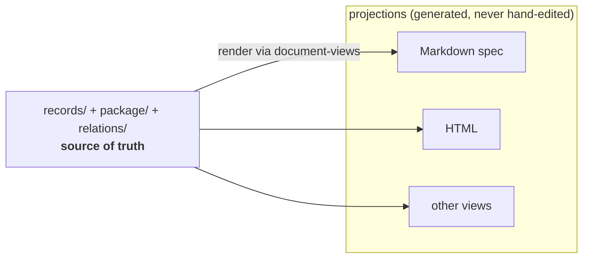
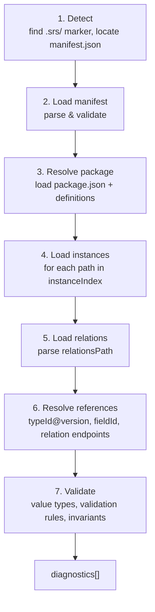
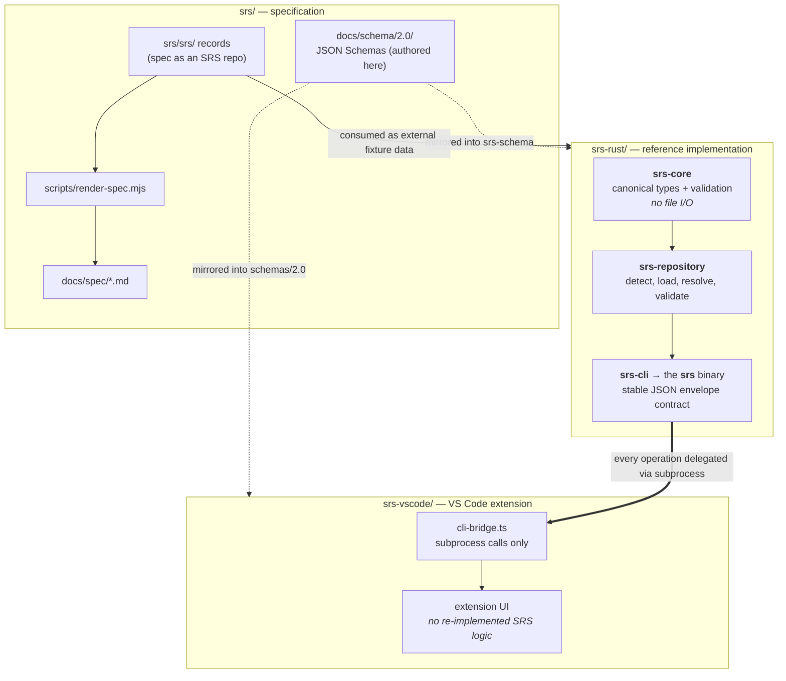

# SRS — How It Works

This page shows how the constructs from [concepts.md](concepts.md) come together into a
working repository, how data is loaded and validated, and how the three repositories of the
project are built. For normative rules, see the [specification](../spec/srs-spec.md).

## A repository on disk

A directory becomes an SRS repository when it contains a `.srs/` marker directory. The
manifest is always `manifest.json` at the root.

```text
my-repo/
├── .srs/             marker directory — its presence signals an SRS repo root
├── manifest.json     declares repositoryId, srsVersion, instanceIndex, packageRef, …
├── package/          field, type, vocabulary, relation-type & view definitions
│   ├── package.json      index of all definitions
│   ├── fields/           one file per Field
│   ├── types/            one file per Type
│   ├── relation-types/   canonical & custom relation type definitions
│   ├── vocabularies/     controlled-value sets (Term lists)
│   └── document-views/   how to render records into output
├── records/          instance files (Notes, TypedRecords, Records) — one JSON each
├── relations/        relation files (default: relations/relations.json)
├── containers/       container (grouping) definitions
└── source-documents/ reference materials with .meta.json sidecars
```

The **`instanceIndex` in `manifest.json` is the single source of truth** for what belongs
to the repository. A file sitting in `records/` that isn't listed in the index is **not** a
member. The manifest also declares which `declaredExtensions` are active, so consumers know
the contract up front.

## Records are the truth; documents are projections

This is the principle that shapes everything. The structured records are authoritative; any
human-readable document is regenerated from them.



The SRS specification itself works exactly this way: `srs/srs/` is an SRS repository whose
records *are* the spec, and the Markdown under `docs/spec/` is rendered from them. You
change the records, then run `node scripts/render-spec.mjs` to regenerate the documents —
you never edit the generated Markdown by hand.

## The loading & validation pipeline

When a tool opens a repository, it runs a fixed pipeline (implemented in the
`srs-repository` crate):



Step 6 is where the graph is checked for integrity: every Record's `typeId@typeVersion`
must resolve in the package, every Type's `fieldId` must resolve, and every Relation's
endpoints must be instances listed in the index.

> **Key trap:** validation failures are collected into a `diagnostics[]` array — they do
> **not** cause a non-zero exit code. **Exit code `0` means "the command ran", not "the
> data is valid".** Always check `payload.diagnostics` separately.

## The three repositories, and how data flows

The project is split so the **specification can stand entirely on its own** — it must
remain valid with no Rust or JavaScript present. The implementation consumes the spec as
external data; it never embeds spec content.



- **`srs-core`** holds the canonical Rust types, ID resolution, and validation — and does
  **no file I/O**.
- **`srs-repository`** does the detection, loading, package resolution, and runs the
  pipeline above, building the compiled model. It depends on `srs-core`.
- **`srs-cli`** is the `srs` binary. It exposes the stable JSON contract and owns exit-code
  handling; it carries no business logic of its own.
- **`srs-vscode`** is a thin client: `cli-bridge.ts` shells out to the `srs` binary for
  everything, so the extension and any other consumer share one source of behavior.

## The CLI contract

Every `srs` command returns a JSON envelope:

```json
{ "ok": true, "command": "...", "version": "0.1.0", "payload": { ... } }
```

On failure, `"ok"` is `false` and problems are reported in a top-level `"diagnostics"`
array. Combined with the exit-code rule above, the pattern for any tool (or agent) is:
**run the command, then inspect `payload.diagnostics` to judge validity** — never rely on
the exit code alone.

All commands accept global options including `--repo <PATH>` (auto-detected from the
working directory if omitted), `--pretty`, and `--container <ID>` to scope an operation to
one container's membership.

## Where to go next

- The full command reference and the agentic usage rules (discovery ladder, write
  workflows, common traps) live in **`srs-usage.md`** at the repo root.
- The normative specification is in [../spec/srs-spec.md](../spec/srs-spec.md); design
  rationale is in [../spec/srs-rationale.md](../spec/srs-rationale.md).
- A complete worked example is under [../spec/examples/](../spec/examples/).
