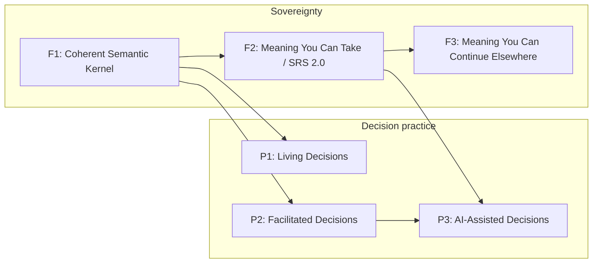
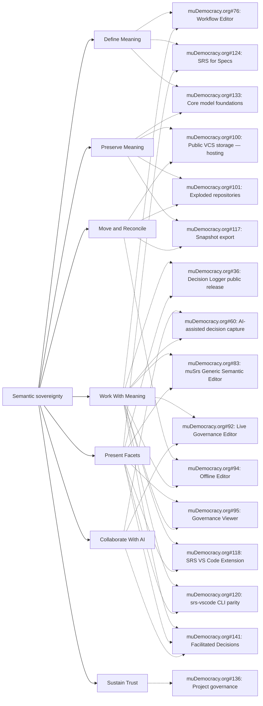

# SRS owner strategic map

> Generated from `roadmap.json` by `node scripts/roadmap.mjs --write`. Do not edit this file directly.

The owner-governed release map above GitHub execution detail. It keeps semantic sovereignty and practical decision-making visible together.

> Bootstrap status: This JSON is a temporary curated source. Once the post-#256 model is usable, migrate its mission, boundaries, tasks and relations into an SRS repository and generate this map as a DocumentView or equivalent projection.

## Mission and roadmap constitution

**Status:** Ratified on 2026-08-15. The project owner is currently the sole decision-maker.

> Increase collective agency by helping groups develop the practice of making clear, accountable decisions together in an age of AI.

**μDemocracy:** muDemocracy turns ordinary conversation into a living practice of collective decision-making. AI makes skilled facilitation and coaching more accessible; judgment, commitment and authority remain with people.

**SRS:** SRS is an open standard for portable semantic documents that people and AI can understand and use. Semantic sovereignty means a group can possess, inspect, understand, move, present and continue working with its meaning without dependence on the application, service, storage provider or AI model that created it.

### Human–AI constitution

> AI may observe, extract, propose, question, organise, explain and coach. People decide, agree, ratify and remain accountable.

### Roadmap test

Every boundary and gate task is judged against these questions:

1. Does it help a group practise and improve collective decision-making?

2. Does it complete the meeting-to-ratified-record loop?

3. Does it make meaning independently understandable and navigable?

4. Does it preserve meaning across tools, storage systems, AI providers and time?

5. Does it keep AI assistive and human authority explicit?

6. Does it establish or protect a root invariant that becomes expensive to change after release?

## Two release tracks

F2 is the first concentrated post-kernel effort. P1 and P2 may progress after F1; P3 requires both F2 and P2.

## Sovereignty

Meaning survives independently of the system that created it.

### F1 — Coherent Semantic Kernel

**Actor:** Maintainer of a first-party SRS package

**Promise:** One authoritative semantic model migrates and regenerates without silent meaning loss.

**Durable artifact:** Migrated first-party corpus with generated conformance evidence.

**Entry criteria:** #256 closure checklist is agreed; First-party corpus inventory is known

**Included capabilities:** Define Meaning, Preserve Meaning, Present Facets

**Explicit exclusions:** Independent portable archive; Offline reintegration; Runtime AI ratification

**End-to-end walkthrough:** Regenerate the first-party corpus from the authoritative model, validate it through independent Node and Rust paths, and inspect canonical state through more than one DocumentView.

**Compatibility promise:** The migrated kernel has one source of truth and reproducible projections.

**What becomes stable:** Core identity, reference resolution and regeneration invariants are stable enough to build outward.

| Task | Role |
| --- | --- |
| [#256](https://github.com/the-greenman/srs/issues/256) | gate |
| [#133](https://github.com/the-greenman/muDemocracy.org/issues/133) | supporting |
| [#375](https://github.com/the-greenman/srs/issues/375) | evidence |

### F2 — Meaning You Can Take / SRS 2.0

**Actor:** Independent user with no originating-service access

**Promise:** A Decision Logger export opens, validates, explains itself and renders offline as a self-contained semantic repository.

**Durable artifact:** Portable `.srs` export, generic readable fallback and independent conformance proof.

**Entry criteria:** F1 evidence is green; Archive, completeness and version-closure tests are defined

**Included capabilities:** Define Meaning, Preserve Meaning, Present Facets, Move and Reconcile

**Explicit exclusions:** Editing and reintegration; Cryptographic authority profiles; Federation negotiation

**End-to-end walkthrough:** Export a Decision Logger repository, disconnect from its service, then recover definitions, records, relations, provenance and a readable facet while accurately reporting missing evidence or unsupported semantics.

**Compatibility promise:** Frozen publications resolve their declared closure reproducibly and remain independent of live Views.

**What becomes stable:** The public SRS boundary: Continuity becomes the default.

| Task | Role |
| --- | --- |
| [#384](https://github.com/the-greenman/srs/issues/384) | gate |
| [#117](https://github.com/the-greenman/muDemocracy.org/issues/117) | gate |
| [#113](https://github.com/the-greenman/muDemocracy.org/issues/113) | gate |
| [#385](https://github.com/the-greenman/srs/issues/385) | gate |
| [#386](https://github.com/the-greenman/srs/issues/386) | gate |
| [#142](https://github.com/the-greenman/muDemocracy.org/issues/142) | gate |
| [#71](https://github.com/the-greenman/muDemocracy.org/issues/71) | gate |
| [#312](https://github.com/the-greenman/srs/issues/312) | gate |
| [#375](https://github.com/the-greenman/srs/issues/375) | evidence |
| [#340](https://github.com/the-greenman/srs/issues/340) | supporting |

### F3 — Meaning You Can Continue Elsewhere

**Actor:** Collaborator continuing work from a clone or export

**Promise:** A user edits offline, inspects semantic differences and reintegrates without losing identity, relations, provenance or unsupported content.

**Durable artifact:** Reintegrated repository with reviewable semantic diff and preserved unsupported-content diagnostics.

**Entry criteria:** F2 walkthrough passes; Diff and reintegration contracts are accepted

**Included capabilities:** Preserve Meaning, Work With Meaning, Move and Reconcile, Sustain Trust

**Explicit exclusions:** Container-slice reintegration; Hosted VCS; Federation negotiation

**End-to-end walkthrough:** Clone or export a repository, make an offline change, inspect the semantic diff, and reintegrate while verifying record identities, relations, provenance and opaque extensions.

**Compatibility promise:** Interchange never silently discards data a conforming reader cannot interpret.

**What becomes stable:** Offline continuation and reintegration form a reliable cross-installation collaboration boundary.

| Task | Role |
| --- | --- |
| [#94](https://github.com/the-greenman/muDemocracy.org/issues/94) | gate |
| [#62](https://github.com/the-greenman/muDemocracy.org/issues/62) | gate |
| [#63](https://github.com/the-greenman/muDemocracy.org/issues/63) | gate |
| [#64](https://github.com/the-greenman/muDemocracy.org/issues/64) | gate |
| [#65](https://github.com/the-greenman/muDemocracy.org/issues/65) | gate |
| [#387](https://github.com/the-greenman/srs/issues/387) | gate |
| [#388](https://github.com/the-greenman/srs/issues/388) | gate |
| [#143](https://github.com/the-greenman/muDemocracy.org/issues/143) | gate |
| [#116](https://github.com/the-greenman/muDemocracy.org/issues/116) | later |
| [#100](https://github.com/the-greenman/muDemocracy.org/issues/100) | supporting |
| [#101](https://github.com/the-greenman/muDemocracy.org/issues/101) | supporting |

## Decision practice

Groups create, maintain and improve accountable decisions together.

### P1 — Living Decisions

**Actor:** Group returning to its decisions over time

**Promise:** A group upgrades its decision repository, reviews commitments when due and supersedes decisions with an accountable history.

**Durable artifact:** Upgradable decision repository with living-decision history.

**Entry criteria:** F1 is closed; Decision Logger safe-to-try baseline exists

**Included capabilities:** Work With Meaning, Preserve Meaning, Present Facets

**Explicit exclusions:** Projected Protocol facilitation; AI-assisted drafting

**End-to-end walkthrough:** Upgrade a repository, identify a decision due for review, supersede it, and inspect the resulting history.

**Compatibility promise:** Package upgrades and supersession preserve prior decision meaning and lineage.

**What becomes stable:** The Decision Logger supports decisions as a maintained practice, not a one-time log.

| Task | Role |
| --- | --- |
| [#36](https://github.com/the-greenman/muDemocracy.org/issues/36) | gate |
| [#56](https://github.com/the-greenman/muDemocracy.org/issues/56) | gate |
| [#57](https://github.com/the-greenman/muDemocracy.org/issues/57) | gate |
| [#58](https://github.com/the-greenman/muDemocracy.org/issues/58) | gate |
| [#59](https://github.com/the-greenman/muDemocracy.org/issues/59) | gate |

### P2 — Facilitated Decisions

**Actor:** Group gathered around a shared decision process

**Promise:** A group works through a projected semantic Protocol, agrees wording live and ratifies a complete decision.

**Durable artifact:** Ratified decision produced by a resumable Protocol run and readable as a whole.

**Entry criteria:** F1 is closed; Decision Logger safe-to-try baseline exists

**Included capabilities:** Work With Meaning, Present Facets

**Explicit exclusions:** AI-generated wording; Transcript ingestion

**End-to-end walkthrough:** Project a Protocol, guide the group through each stage, resume after interruption, review the assembled record, ratify it and later read it back.

**Compatibility promise:** The Protocol presents and guides canonical meaning; it does not own or alter it.

**What becomes stable:** Manual facilitated decision-making is a first-class SRS application pattern.

| Task | Role |
| --- | --- |
| [#141](https://github.com/the-greenman/muDemocracy.org/issues/141) | gate |
| [#66](https://github.com/the-greenman/muDemocracy.org/issues/66) | gate |
| [#67](https://github.com/the-greenman/muDemocracy.org/issues/67) | gate |
| [#144](https://github.com/the-greenman/muDemocracy.org/issues/144) | gate |

### P3 — AI-Assisted Decisions

**Actor:** Group using AI as a facilitator and drafting assistant

**Promise:** AI reads a live or recorded transcript, proposes stage-appropriate text with provenance, and people edit, agree and ratify it.

**Durable artifact:** Human-ratified decision with transcript-linked AI proposal provenance.

**Entry criteria:** F2 and P2 walkthroughs pass; Addressability and Protocol runs are available

**Included capabilities:** Collaborate With AI, Work With Meaning, Preserve Meaning

**Explicit exclusions:** AI authority over commitment; Federation

**End-to-end walkthrough:** Use a live transcript during a Protocol run, request a stage recommendation, edit it with the group, ratify the resulting decision and inspect the source provenance.

**Compatibility promise:** AI assistance never silently commits canonical meaning; attribution and human ratification remain inspectable.

**What becomes stable:** AI may participate as a transparent coach inside a human-owned decision practice.

| Task | Role |
| --- | --- |
| [#60](https://github.com/the-greenman/muDemocracy.org/issues/60) | gate |
| [#68](https://github.com/the-greenman/muDemocracy.org/issues/68) | gate |
| [#71](https://github.com/the-greenman/muDemocracy.org/issues/71) | gate |
| [#72](https://github.com/the-greenman/muDemocracy.org/issues/72) | gate |
| [#236](https://github.com/the-greenman/srs-rust/issues/236) | gate |
| [#252](https://github.com/the-greenman/srs-rust/issues/252) | gate |

**Known gaps**

| Gap | Owner | Activation trigger |
| --- | --- | --- |
| TSS schema and transcript-ingestion contract | muDemocracy.org#60 | Create concrete stories after P2 establishes the manual Protocol run. |
| AI-assisted meeting walkthrough | muDemocracy.org#60 | Create when transcript ingestion and stage recommendations have runnable surfaces. |

## Capability map

Delivery surfaces across all branches: Web, VS Code, CLI, WASM.

## Epic and workstream disposition

| Epic | Disposition | Role | Rationale |
| --- | --- | --- | --- |
| [#36](https://github.com/the-greenman/muDemocracy.org/issues/36) Decision Logger public release | keep release | P1 living-decisions outcome | R1 is complete; R2/R3 are the P1 gate. |
| [#60](https://github.com/the-greenman/muDemocracy.org/issues/60) AI-assisted decision capture | keep release | P3 AI-assisted outcome | AI overlays the completed human Protocol, never replaces it. |
| [#76](https://github.com/the-greenman/muDemocracy.org/issues/76) Workflow Editor | keep release | candidate outcome release | Human authoring surface, not the kernel. |
| [#83](https://github.com/the-greenman/muDemocracy.org/issues/83) muSrs Generic Semantic Editor | keep release | candidate outcome release | Validates semantic editing and inspection. |
| [#92](https://github.com/the-greenman/muDemocracy.org/issues/92) Live Governance Editor | keep release | candidate outcome release | P2 Protocol stories reparented to #141. |
| [#94](https://github.com/the-greenman/muDemocracy.org/issues/94) Offline Editor | keep release | F3 outcome release | Whole-repository continuation proof. |
| [#95](https://github.com/the-greenman/muDemocracy.org/issues/95) Governance Viewer | keep release | candidate outcome release | Readable facet of durable governance meaning. |
| [#100](https://github.com/the-greenman/muDemocracy.org/issues/100) Public VCS storage — hosting | demote to workstream | F3 supporting delivery workstream | Hosted storage is not an F3 gate. |
| [#101](https://github.com/the-greenman/muDemocracy.org/issues/101) Exploded repositories | reparent | F3 supporting delivery workstream | Supports reviewable VCS storage. |
| [#117](https://github.com/the-greenman/muDemocracy.org/issues/117) Snapshot export | keep release | F2 archive outcome | Principal portable-archive capability. |
| [#118](https://github.com/the-greenman/muDemocracy.org/issues/118) SRS VS Code Extension | demote to workstream | cross-cutting delivery workstream | Delivery surface, not a capability branch. |
| [#120](https://github.com/the-greenman/muDemocracy.org/issues/120) srs-vscode CLI parity | merge | VS Code delivery workstream | Proposed merge into #118. |
| [#124](https://github.com/the-greenman/muDemocracy.org/issues/124) SRS for Specs | keep release | candidate outcome release | Spec-authoring package and publication consumer. |
| [#133](https://github.com/the-greenman/muDemocracy.org/issues/133) Core model foundations | demote to workstream | F1 standards-convergence workstream | Converges with #256; not a product release. |
| [#136](https://github.com/the-greenman/muDemocracy.org/issues/136) Project governance | demote to workstream | Sustain Trust workstream | Keeps purpose and decisions inspectable. |
| [#141](https://github.com/the-greenman/muDemocracy.org/issues/141) Facilitated Decisions | keep release | P2 facilitated-decision outcome | Manual Protocol and ratification precede AI assistance. |

## Use

- Regenerate: `node scripts/roadmap.mjs --write`.
- Verify generated output: `node scripts/roadmap.mjs --check`.
- Overlay live GitHub state: `node scripts/roadmap.mjs --status`.
