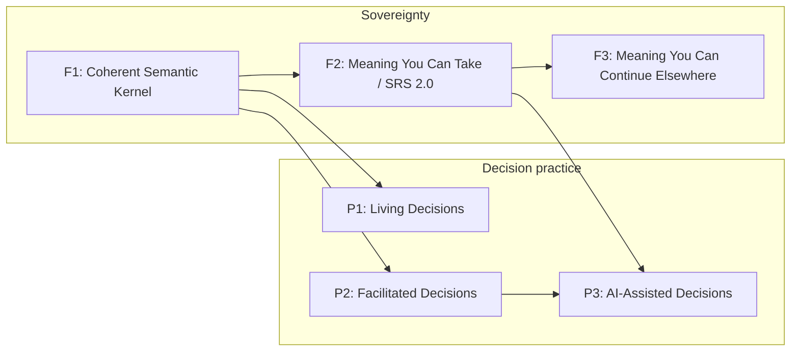
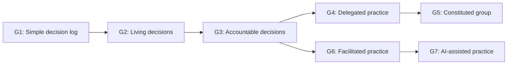
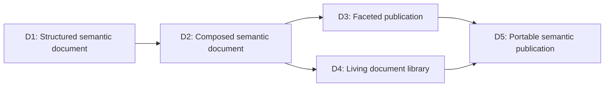
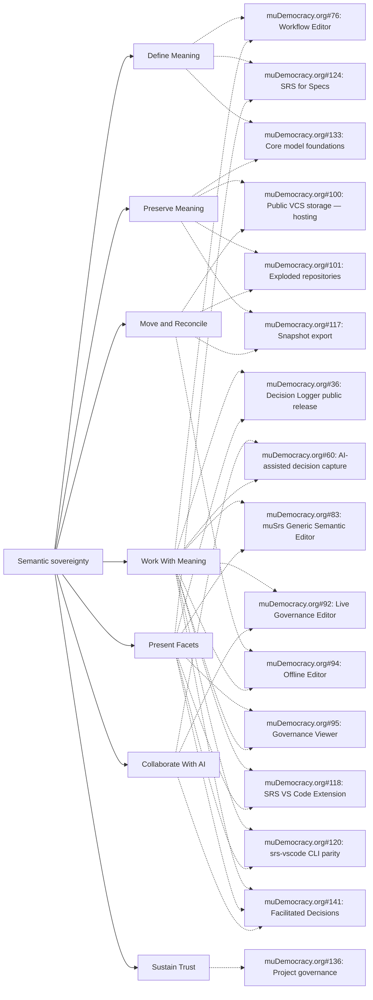

# SRS strategic map

> Generated from `roadmap.json` by `node scripts/roadmap.mjs --write`. Do not edit this file directly.

A map of the capabilities and release boundaries needed for semantic sovereignty and practical human–AI collaboration.

> Source status: This map is a curated logical SRS projection: stable strategic entities, explicit semantic links, and separate assessments. It will later materialize as SRS Records, Relations, Containers and DocumentViews after the post-#256 model settles.

## Mission and roadmap constitution

**Current direction:** Ratified on 2026-08-15.

> Increase collective agency by helping groups develop the practice of making clear, accountable decisions together in an age of AI.

**μDemocracy:** muDemocracy turns ordinary conversation into a living practice of collective decision-making. AI makes skilled facilitation and coaching more accessible; judgment, commitment and authority remain with people.

**SRS:** SRS is an open standard for portable semantic documents that people and AI can understand and use. Semantic sovereignty means a group can possess, inspect, understand, move, present and continue working with its meaning without dependence on the application, service, storage provider or AI model that created it.

## First usable application

**srs-web / app.mudemocracy.org** — The first usable SRS application: an opinionated surface for people to inspect, edit, validate and work with their own semantic repositories.

**Architecture:** One repository runtime and one canonical edit, save, import and export path. Repository, container workspace, facilitation and blueprint-authoring modes are projections over that shared substrate, never separate semantic stores.

### Boundary rules

- The application is generic about repository, Record, Relation, Container, Package, validation, navigation and preservation behaviour.

- Blueprints select a workspace and presentation without changing canonical meaning.

- Governance packages define decisions, roles, ratification, review and supersession; they are replaceable application content, not application-owned semantics.

- Protocols guide work against canonical state; DocumentViews present it; neither becomes an authoritative store.

- AI proposes visibly within a current Protocol or Blueprint context. Human review and ratification alone commit canonical meaning.

### Modes over the shared substrate

- Repository inspection and direct semantic editing

- Container workspace for ordinary group work

- Shared-screen Protocol facilitation

- Blueprint and package authoring

### Origin prototype

The separate decision-logger repository is an earlier prototype and research corpus. It informs fixtures, scenarios and migration learning, but is not a canonical SRS producer, consumer or release dependency unless explicitly restarted on current SRS contracts.

### Human–AI constitution

> AI may observe, extract, propose, question, organise, explain and coach. People decide, agree, ratify and remain accountable.

### Roadmap test

Every boundary and gate task is judged against these questions:

1. Does it help a group practise and improve collective decision-making?

2. Does it complete the meeting-to-ratified-record loop?

3. Does it make meaning independently understandable and navigable?

4. Does it preserve meaning across tools, storage systems, AI providers and time?

5. Does it keep AI assistive and human authority explicit?

6. Does it establish or protect a root invariant that becomes expensive to change after release?

## Two release tracks

F2 is the first concentrated post-kernel effort. P1 and P2 may progress after F1; P3 requires both F2 and P2.

## Sovereignty

Meaning survives independently of the system that created it.

### F1 — Coherent Semantic Kernel

**Actor:** Maintainer of a first-party SRS package

**Promise:** One authoritative semantic model migrates and regenerates without silent meaning loss.

**Durable artifact:** Migrated first-party corpus with generated conformance evidence.

**Entry criteria:** #256 closure checklist is agreed; First-party corpus inventory is known

**Included capabilities:** Define Meaning, Preserve Meaning, Present Facets

**Explicit exclusions:** Independent portable archive; Offline reintegration; Runtime AI ratification

**End-to-end walkthrough:** Regenerate the first-party corpus from the authoritative model, validate it through independent Node and Rust paths, and inspect canonical state through more than one DocumentView.

**Compatibility promise:** The migrated kernel has one source of truth and reproducible projections.

**What becomes stable:** Core identity, reference resolution and regeneration invariants are stable enough to build outward.

| Task | Role |
| --- | --- |
| [#256](https://github.com/the-greenman/srs/issues/256) | gate |
| [#133](https://github.com/the-greenman/muDemocracy.org/issues/133) | supporting |
| [#375](https://github.com/the-greenman/srs/issues/375) | evidence |

### F2 — Meaning You Can Take / SRS 2.0

**Actor:** Independent user with no originating-service access

**Promise:** A realistic SRS governance repository opens, validates, explains itself and renders offline as a self-contained semantic repository.

**Durable artifact:** Portable `.srs` export, generic readable fallback and independent conformance proof.

**Entry criteria:** F1 evidence is green; Archive, completeness and version-closure tests are defined

**Included capabilities:** Define Meaning, Preserve Meaning, Present Facets, Move and Reconcile

**Explicit exclusions:** Editing and reintegration; Cryptographic authority profiles; Federation negotiation

**End-to-end walkthrough:** Export an SRS-native governance repository or fixed governance fixture, disconnect from its originating service, then recover definitions, records, relations, provenance and a readable facet while accurately reporting missing evidence or unsupported semantics.

**Compatibility promise:** Frozen publications resolve their declared closure reproducibly and remain independent of live Views.

**What becomes stable:** The public SRS boundary: Continuity becomes the default.

| Task | Role |
| --- | --- |
| [#384](https://github.com/the-greenman/srs/issues/384) | gate |
| [#117](https://github.com/the-greenman/muDemocracy.org/issues/117) | gate |
| [#113](https://github.com/the-greenman/muDemocracy.org/issues/113) | gate |
| [#385](https://github.com/the-greenman/srs/issues/385) | gate |
| [#386](https://github.com/the-greenman/srs/issues/386) | gate |
| [#142](https://github.com/the-greenman/muDemocracy.org/issues/142) | supporting |
| [#71](https://github.com/the-greenman/muDemocracy.org/issues/71) | gate |
| [#312](https://github.com/the-greenman/srs/issues/312) | gate |
| [#375](https://github.com/the-greenman/srs/issues/375) | evidence |
| [#340](https://github.com/the-greenman/srs/issues/340) | supporting |

**Known gaps**

| Gap | Owner | Activation trigger |
| --- | --- | --- |
| SRS-web F2 portable-reader walkthrough | srs#384 | Create and make a gate when the SRS-web repository runtime can open a portable archive without service access. |

### F3 — Meaning You Can Continue Elsewhere

**Actor:** Collaborator continuing work from a clone or export

**Promise:** A user edits offline, inspects semantic differences and reintegrates without losing identity, relations, provenance or unsupported content.

**Durable artifact:** Reintegrated repository with reviewable semantic diff and preserved unsupported-content diagnostics.

**Entry criteria:** F2 walkthrough passes; Diff and reintegration contracts are accepted

**Included capabilities:** Preserve Meaning, Work With Meaning, Move and Reconcile, Sustain Trust

**Explicit exclusions:** Container-slice reintegration; Hosted VCS; Federation negotiation

**End-to-end walkthrough:** Clone or export a repository, make an offline change, inspect the semantic diff, and reintegrate while verifying record identities, relations, provenance and opaque extensions.

**Compatibility promise:** Interchange never silently discards data a conforming reader cannot interpret.

**What becomes stable:** Offline continuation and reintegration form a reliable cross-installation collaboration boundary.

| Task | Role |
| --- | --- |
| [#94](https://github.com/the-greenman/muDemocracy.org/issues/94) | gate |
| [#62](https://github.com/the-greenman/muDemocracy.org/issues/62) | gate |
| [#63](https://github.com/the-greenman/muDemocracy.org/issues/63) | gate |
| [#64](https://github.com/the-greenman/muDemocracy.org/issues/64) | gate |
| [#65](https://github.com/the-greenman/muDemocracy.org/issues/65) | gate |
| [#387](https://github.com/the-greenman/srs/issues/387) | gate |
| [#388](https://github.com/the-greenman/srs/issues/388) | gate |
| [#143](https://github.com/the-greenman/muDemocracy.org/issues/143) | gate |
| [#116](https://github.com/the-greenman/muDemocracy.org/issues/116) | later |
| [#100](https://github.com/the-greenman/muDemocracy.org/issues/100) | supporting |
| [#101](https://github.com/the-greenman/muDemocracy.org/issues/101) | supporting |

## Decision practice

Groups create, maintain and improve accountable decisions together.

### P1 — Living Decisions

**Actor:** Group returning to its decisions over time

**Promise:** A group uses the SRS-web governance workspace to review commitments when due and supersede decisions with an accountable history.

**Durable artifact:** Upgradable decision repository with living-decision history.

**Entry criteria:** F1 is closed; SRS-web safe-to-try governance baseline exists

**Included capabilities:** Work With Meaning, Preserve Meaning, Present Facets

**Explicit exclusions:** Projected Protocol facilitation; AI-assisted drafting

**End-to-end walkthrough:** In srs-web, upgrade a repository, identify a decision due for review, supersede it, and inspect the resulting history.

**Compatibility promise:** Package upgrades and supersession preserve prior decision meaning and lineage.

**What becomes stable:** The SRS-web governance workspace supports decisions as a maintained practice, not a one-time log.

| Task | Role |
| --- | --- |
| [#36](https://github.com/the-greenman/muDemocracy.org/issues/36) | gate |
| [#56](https://github.com/the-greenman/muDemocracy.org/issues/56) | gate |
| [#57](https://github.com/the-greenman/muDemocracy.org/issues/57) | gate |
| [#58](https://github.com/the-greenman/muDemocracy.org/issues/58) | gate |
| [#59](https://github.com/the-greenman/muDemocracy.org/issues/59) | gate |

### P2 — Facilitated Decisions

**Actor:** Group using the shared-screen facilitation mode of the SRS-web governance workspace

**Promise:** A group works through a projected semantic Protocol, agrees wording live and ratifies a complete decision.

**Durable artifact:** Ratified decision produced by a resumable Protocol run and readable as a whole.

**Entry criteria:** F1 is closed; SRS-web can open and edit the governance container workspace

**Included capabilities:** Work With Meaning, Present Facets

**Explicit exclusions:** AI-generated wording; Transcript ingestion and TSS emission; A separate facilitation-only semantic store

**End-to-end walkthrough:** In the same SRS-web repository workspace, project a Protocol, guide the group through each stage, resume after interruption, review the assembled record, ratify it and later read it back.

**Compatibility promise:** The Protocol presents and guides canonical meaning; it does not own or alter it.

**What becomes stable:** Shared-screen manual facilitation is a first-class SRS-web mode, not a separate editor.

| Task | Role |
| --- | --- |
| [#141](https://github.com/the-greenman/muDemocracy.org/issues/141) | gate |
| [#66](https://github.com/the-greenman/muDemocracy.org/issues/66) | gate |
| [#67](https://github.com/the-greenman/muDemocracy.org/issues/67) | gate |
| [#144](https://github.com/the-greenman/muDemocracy.org/issues/144) | gate |
| [#236](https://github.com/the-greenman/srs-rust/issues/236) | gate |
| [#252](https://github.com/the-greenman/srs-rust/issues/252) | evidence |

**Known gaps**

| Gap | Owner | Activation trigger |
| --- | --- | --- |
| P2/P3 substrate split in existing story bodies | muDemocracy.org#141 | Before P2 implementation, move TSS emission and transcript-linked provenance from the manual P2 contract into P3 while retaining Protocol-run attention state in P2. |

### P3 — AI-Assisted Decisions

**Actor:** Group using AI inside the current SRS-web Protocol workspace

**Promise:** AI reads a live or recorded transcript, proposes stage-appropriate text with provenance, and people edit, agree and ratify it.

**Durable artifact:** Human-ratified decision with transcript-linked AI proposal provenance.

**Entry criteria:** F2 and P2 walkthroughs pass; Addressability and Protocol runs are available

**Included capabilities:** Collaborate With AI, Work With Meaning, Preserve Meaning

**Explicit exclusions:** AI authority over commitment; Federation; A separate AI-specific editor or canonical store

**End-to-end walkthrough:** In the same SRS-web Protocol workspace, use a live transcript, request a stage recommendation, edit it with the group, ratify the resulting decision and inspect the source provenance.

**Compatibility promise:** AI assistance never silently commits canonical meaning; attribution and human ratification remain inspectable.

**What becomes stable:** AI may participate as a transparent coach inside a human-owned decision practice.

| Task | Role |
| --- | --- |
| [#60](https://github.com/the-greenman/muDemocracy.org/issues/60) | gate |
| [#68](https://github.com/the-greenman/muDemocracy.org/issues/68) | gate |
| [#71](https://github.com/the-greenman/muDemocracy.org/issues/71) | gate |
| [#72](https://github.com/the-greenman/muDemocracy.org/issues/72) | gate |
| [#236](https://github.com/the-greenman/srs-rust/issues/236) | supporting |
| [#252](https://github.com/the-greenman/srs-rust/issues/252) | supporting |

**Known gaps**

| Gap | Owner | Activation trigger |
| --- | --- | --- |
| TSS schema and transcript-ingestion contract | muDemocracy.org#60 | Create concrete stories after P2 establishes the manual Protocol run. |
| AI-assisted meeting walkthrough | muDemocracy.org#60 | Create when transcript ingestion and stage recommendations have runnable surfaces. |

## SRS capability architecture

The standard-level contracts that make the release boundaries and practice paths possible. A contract is not an application feature: it is a promise that independent SRS implementations can rely on.

| Stability | Meaning |
| --- | --- |
| Lock before F1 | A root semantic contract. Changing it after the coherent-kernel release would require a breaking migration. |
| Settle before F2 | Required for an independently understandable, portable SRS publication. |
| Settle before F3 | Required when a repository can be continued and reconciled across installations. |
| Extension or profile | Built on the stable substrate; it may evolve without redefining the preservation kernel. |
| Deliberately deferred | Important, but not required for the current public SRS boundary. |
- **Coherent semantic kernel** — Independent implementations resolve the same canonical meaning, validate it consistently, and regenerate reproducible projections.
  - Stability: Lock before F1
  - Required by: F1, D1, D2
  - Sources: [srs-unified.md](../spec/srs-unified.md)
  - Not included: A particular editor, database, governance model or preferred layout
  - **Identity and reference resolution** — Records, definitions and structural members have durable identity and unambiguous references across a repository and its installed packages.
    - Stability: Lock before F1
    - Required by: F1, D1, D2
    - Sources: [srs-unified.md](../spec/srs-unified.md)
    - Not included: Repository-copy and merge identity
  - **Definitions and structural navigation** — Fields, Types, Records, Relations, Containers and Packages compose inspectable semantic documents with navigable structure.
    - Stability: Lock before F1
    - Required by: F1, D1, D2, G1
    - Sources: [srs-unified.md](../spec/srs-unified.md)
    - Not included: Website-specific document or decision schemas
    - **Layered default values** — When a real authoring surface needs pre-filled values, it can use one versioned layered-default mechanism whose effective value resolves Protocol → Type → Field; a default never satisfies a required Field.
      - Stability: Deliberately deferred
      - Required by: future work
      - Sources: [#431](https://github.com/the-greenman/srs/issues/431)
      - Not included: A separate default mechanism at each of the Field, Type and Protocol layers; Treating a default as satisfying requiredness; A current F1, F2, F3 or practice-track release gate
  - **Canonical meaning and facets** — A repository declares one repository-owned set of presentations it commits to render and can produce reproducible, readable projections from canonical meaning; neither the presentations nor their projections becomes an authoritative store.
    - Stability: Lock before F1
    - Required by: F1, F2, D2, D3, G1
    - Sources: [srs-unified.md](../spec/srs-unified.md), [rfc-015-view-owned-ordering-declared-presentations.md](../../rfcs/rfc-015-view-owned-ordering-declared-presentations.md)
    - Not included: A single required renderer, theme or layout-preservation promise; Byte-identical rendering across independent implementations
- **Portable semantic publication** — A person can take an SRS repository away from its originating service and still recover its definitions, canonical meaning, provenance and a readable orientation.
  - Stability: Settle before F2
  - Required by: F2, D3, D5
  - Sources: [srs-unified.md](../spec/srs-unified.md)
  - Not included: Editing, merge, federation or a promise that every attachment is present
  - **Definition closure and completeness** — A frozen publication declares the exact definitions and versions it needs, and accurately reports evidence or other content that is absent.
    - Stability: Settle before F2
    - Required by: F2, D5
    - Sources: [srs-unified.md](../spec/srs-unified.md)
    - Not included: Silent substitution of live definitions or implied evidence completeness
  - **Generic orientation and fallback rendering** — A conforming reader can navigate and explain a repository without its preferred application, theme or DocumentView.
    - Stability: Settle before F2
    - Required by: F2, D3, D5
    - Sources: [srs-unified.md](../spec/srs-unified.md)
    - Not included: Reproducing a publisher’s exact visual layout
- **Continuation and reconciliation** — A repository can be copied, changed elsewhere and reconciled without silently losing semantic identity, relations, provenance or unsupported content.
  - Stability: Settle before F3
  - Required by: F3, D4, D5
  - Sources: [rfc-010-assisted-three-way-merge.md](../../rfcs/rfc-010-assisted-three-way-merge.md)
  - Not included: Hosted VCS, federation negotiation or automatic conflict resolution
  - **Copy identity, semantic diff and merge** — Independent implementations can compare and reintegrate semantic changes using stable identity and explicit conflict semantics rather than raw-file coincidence.
    - Stability: Settle before F3
    - Required by: F3, D4, D5
    - Sources: [rfc-010-assisted-three-way-merge.md](../../rfcs/rfc-010-assisted-three-way-merge.md)
    - Not included: A required storage backend or a guarantee that every conflict is automatically resolved
- **Practice extensions** — Governance and collaboration practices use the preservation substrate, but do not redefine it.
  - Stability: Extension or profile
  - Required by: P1, P2, P3, G1, G2, G3, G4, G5, G6, G7
  - Sources: [mudemocracy-rfc-candidates.md](../../rfcs/mudemocracy-rfc-candidates.md)
  - Not included: A universal governance ontology or mandatory AI behaviour
  - **Governance profile** — Decision, role, mandate, ratification and founding-document semantics are installable domain definitions, not SRS root types.
    - Stability: Extension or profile
    - Required by: P1, P2, G1, G2, G3, G4, G5
    - Sources: [mudemocracy-rfc-candidates.md](../../rfcs/mudemocracy-rfc-candidates.md)
    - Not included: Hard-coded governance behaviour in a generic reader
  - **Protocol and AI provenance** — A Protocol can guide a human process, while transcript-linked AI proposals carry inspectable provenance and human ratification evidence.
    - Stability: Extension or profile
    - Required by: P2, P3, G6, G7
    - Sources: [srs-unified.md](../spec/srs-unified.md), [mudemocracy-rfc-candidates.md](../../rfcs/mudemocracy-rfc-candidates.md)
    - Not included: AI authority to commit canonical meaning
  - **Integrity profiles and federation** — Cryptographic authority, attestations and cross-community semantic negotiation remain future layers above portable meaning.
    - Stability: Deliberately deferred
    - Required by: future work
    - Sources: [srs-unified.md](../spec/srs-unified.md)
    - Not included: A requirement for the F1, F2 or F3 release promises
  - **Addressability and attention state** — Tools can identify semantic locations, preserve a live point of attention, and refer back to the relevant revision.
    - Stability: Extension or profile
    - Required by: P2, P3, G6, G7
    - Sources: [srs-spec.md](../spec/srs-spec.md), [revisions.json](../schema/2.0/revisions.json), [mudemocracy-rfc-candidates.md](../../rfcs/mudemocracy-rfc-candidates.md), [025-addressability-as-a-prerequisite-for-live-facilitation.json](../../srs/records/design-notes/025-addressability-as-a-prerequisite-for-live-facilitation.json)
    - Not included: A required Git, database or archive backend; AI authority to commit canonical meaning

## Release contract readiness

Each row is a public SRS promise required by a boundary or practice stage. Readiness is assessed separately from GitHub issue state.

| Contract | Required by | Specification | Implementation | Conformance |
| --- | --- | --- | --- | --- |
| Coherent semantic kernel | F1, D1, D2 | not assessed | not assessed | not assessed |
| Identity and reference resolution | F1, D1, D2 | not assessed | not assessed | not assessed |
| Definitions and structural navigation | F1, D1, D2, G1 | not assessed | not assessed | not assessed |
| Layered default values | future | not assessed | not assessed | not assessed |
| Canonical meaning and facets | F1, F2, D2, D3, G1 | not assessed | not assessed | not assessed |
| Portable semantic publication | F2, D3, D5 | not assessed | not assessed | not assessed |
| Definition closure and completeness | F2, D5 | not assessed | not assessed | not assessed |
| Generic orientation and fallback rendering | F2, D3, D5 | not assessed | not assessed | not assessed |
| Continuation and reconciliation | F3, D4, D5 | not assessed | not assessed | not assessed |
| Copy identity, semantic diff and merge | F3, D4, D5 | not assessed | not assessed | not assessed |
| Practice extensions | P1, P2, P3, G1, G2, G3, G4, G5, G6, G7 | not assessed | not assessed | not assessed |
| Governance profile | P1, P2, G1, G2, G3, G4, G5 | not assessed | not assessed | not assessed |
| Protocol and AI provenance | P2, P3, G6, G7 | not assessed | not assessed | not assessed |
| Integrity profiles and federation | future | not assessed | not assessed | not assessed |
| Addressability and attention state | P2, P3, G6, G7 | provisional | not-implemented | unproven |

## Extension register

Extensions are referenced by their normative SRS Records; this register records only their roadmap role and review state.

| Extension | Subject | Required by | Readiness |
| --- | --- | --- | --- |
| Addressability and attention state | srs/records/extensions/ext-addressability.json | P2, P3, G6, G7 | provisional / not-implemented / unproven |

## Current evidence

Assessed evidence snapshot as of 2026-08-15. This is an assessed evidence snapshot, not an issue-status calculation. A claim is proven only by a runnable surface, repeatable test, walkthrough or durable artifact; partial means a useful fragment exists but the boundary promise is not yet demonstrated.

| Boundary | Proven | Partial | Planned | Prototype |
| --- | ---: | ---: | ---: | ---: |
| F1 — Coherent Semantic Kernel | 0 | 3 | 1 | 0 |
| F2 — Meaning You Can Take / SRS 2.0 | 0 | 1 | 2 | 0 |
| F3 — Meaning You Can Continue Elsewhere | 0 | 1 | 2 | 0 |
| P1 — Living Decisions | 1 | 1 | 1 | 0 |
| P2 — Facilitated Decisions | 0 | 1 | 2 | 0 |
| P3 — AI-Assisted Decisions | 0 | 0 | 2 | 1 |

## Capability paths

These paths show the next semantic and procedural capability a group may need. Related work connects the map to active implementation without replacing it.

### Governance practice

A group adopts only the semantic and procedural structure its practice needs next. These stages describe a capability path, not a release plan or issue hierarchy.

| Stage | Capability promise | Release alignment | Activation trigger |
| --- | --- | --- | --- |
| G1 — Simple decision log | A group records decisions with the four-field Quick Log blueprint while retaining a capable canonical Decision Record beneath it. | P1 | A group wants to record and read back decisions without adopting a governance process. |
| G2 — Living decisions | A Decision Record has stable identity through drafting, review, revisit and supersession; operational version history may remain in Git until interoperable history exchange is needed. | P1 | A group needs decisions to remain useful after the meeting in which they first appeared. |
| G3 — Accountable decisions | A decision can be refined across several sessions and linked to declared participation and ratification without making any session the owner of the decision. | P2 | A group needs the participation, timing or authority of a decision to be inspectable. |
| G4 — Delegated practice | A group can define roles, working groups and mandates, then connect decisions to the authority under which they were made. | future | A group delegates recurring work or needs to distinguish who may decide what. |
| G5 — Constituted group | A group maintains purpose and founding documents as governed Records with explicit amendment and special-ratification policy rather than immutable application configuration. | future | A group needs a durable shared purpose or a rule for changing its own rules. |
| G6 — Facilitated practice | A shared-screen Protocol guides people through canonical decision state, can resume after interruption, and ends in whole-record review and human ratification. | P2 | A group wants help holding an actual shared decision process, not merely editing a record. |
| G7 — AI-assisted practice | AI works inside a current Protocol or Blueprint context, proposes visibly with provenance, and never commits canonical meaning without human review and ratification. | P3 | A group has a reliable manual Protocol practice and wants assistive coaching or transcript-grounded drafting. |

#### G1 — Simple decision log

**Group need:** We need a small shared form that lets us remember what we decided.

**Semantic additions:** Decision Record; four essential decision fields; explicit absent rather than inferred information

**Blueprint additions:** Quick Log editing form; readable decision-log facet

**Does not introduce:** sessions or attendance; formal roles or authority; AI assistance

**Related work:** [#36](https://github.com/the-greenman/muDemocracy.org/issues/36)

#### G2 — Living decisions

**Group need:** We need to share a draft, return to it, revisit commitments and replace a decision without losing its history.

**Semantic additions:** draft and ratified lifecycle; review/revisit information; supersession relation

**Blueprint additions:** Decision workspace; review and supersession facets

**Does not introduce:** a meeting-owned decision; attendance or authority claims; a new semantic Record for every working edit

**Related work:** [#36](https://github.com/the-greenman/muDemocracy.org/issues/36), [#57](https://github.com/the-greenman/muDemocracy.org/issues/57), [#58](https://github.com/the-greenman/muDemocracy.org/issues/58)

#### G3 — Accountable decisions

**Group need:** We need to say when a decision was made, who participated and whether the group actually ratified it.

**Semantic additions:** Session Record; declared participation; considered-in and ratified-in relations; ratification event or lifecycle transition

**Blueprint additions:** accountable-decision review; session and ratification summary

**Does not introduce:** formal roles or mandates; a full identity system; TSS or transcript ingestion; AI assistance

**Related work:** [#66](https://github.com/the-greenman/muDemocracy.org/issues/66), [#67](https://github.com/the-greenman/muDemocracy.org/issues/67)

#### G4 — Delegated practice

**Group need:** We need working groups or roles, and need to make their mandates and authority legible.

**Semantic additions:** Role Record; working-group Record; mandate and authority relations

**Blueprint additions:** role and mandate workspace; authority context on decisions

**Does not introduce:** a founding constitution; global identity or federation; automatic enforcement of human authority

**Related work:** None mapped yet

#### G5 — Constituted group

**Group need:** We need to maintain our purpose, objectives and foundational rules, including how those rules may change.

**Semantic additions:** Purpose and founding-document Records; ratification-policy definitions; amendment and evidencing relations

**Blueprint additions:** founding-document workspace; policy-aware amendment review

**Does not introduce:** new SRS root types; hard-coded constitutional behaviour in srs-web; a universal governance ontology

**Related work:** None mapped yet

#### G6 — Facilitated practice

**Group need:** We want to make a decision together in the room or online, one clear step at a time.

**Semantic additions:** Protocol Run; attention state; stage approval

**Blueprint additions:** shared-screen facilitation mode; whole-record ratification review

**Does not introduce:** transcript capture or TSS emission; AI-generated wording; a facilitation-only semantic store

**Related work:** [#141](https://github.com/the-greenman/muDemocracy.org/issues/141), [#236](https://github.com/the-greenman/srs-rust/issues/236)

#### G7 — AI-assisted practice

**Group need:** We want AI to propose useful wording and coaching from conversation evidence while people retain judgment and authority.

**Semantic additions:** TSS and transcript provenance; AI proposal provenance; human review and ratification evidence

**Blueprint additions:** stage-specific AI proposal review; inspectable source-provenance facet

**Does not introduce:** AI authority; an AI-specific editor; a separate canonical store

**Related work:** [#60](https://github.com/the-greenman/muDemocracy.org/issues/60), [#68](https://github.com/the-greenman/muDemocracy.org/issues/68)

### Semantic document practice

A group defines and maintains the meaning, structure and publication facets of a real document together. These are adoption capabilities, not a CMS feature tree or a second set of release gates.

| Stage | Capability promise | Release alignment | Activation trigger |
| --- | --- | --- | --- |
| D1 — Structured semantic document | A document is authored as typed Records in a Container, with explicit fields and relations instead of an opaque page blob. | F1 | A group needs a document whose structure and meaning must remain inspectable as it is written. |
| D2 — Composed semantic document | Blueprints, type inheritance, shared Fields and package definitions compose validated multi-record documents without making the editor own the ontology. | F1 | A group repeats document patterns and wants structure to be reusable, reviewable and independently understandable. |
| D3 — Faceted publication | Authoring, reading, generic fallback and website or print publication are explicit facets over canonical meaning; a publication adapter never becomes the only reader. | F2 | A document must serve readers in more than one context while remaining recoverable without its preferred presentation. |
| D4 — Living document library | Document content and definitions evolve through visible revision, migration and compatibility practices; reusable content remains linked to its semantic context. | F3 | A group maintains a document library long enough that shared definitions and previously published content must change safely. |
| D5 — Portable semantic publication | A publication carries the definition closure, canonical Records and Relations, provenance/completeness diagnostics and a generic readable facet; a later user can continue it without silent loss. | F2, F3 | A document must remain usable and explainable after leaving the system that authored or published it. |

#### D1 — Structured semantic document

**Group need:** We need to write a guide, policy, specification or handbook without separating its content from the structure that makes it understandable.

**Semantic additions:** document root Record; typed content Records; Container membership and ordering relations

**Blueprint additions:** basic document form; generic record navigation

**Does not introduce:** a website-specific page schema; a required bespoke renderer; shared reusable definition packages

**Related work:** [#83](https://github.com/the-greenman/muDemocracy.org/issues/83)

**Research:** Content is maintained meaning: fields need an inspectable change history, not a monolithic document blob. (problem-index/07-field-records/README.md)

#### D2 — Composed semantic document

**Group need:** We need documents with repeatable structure and reusable concepts, rather than one-off forms for every guide or policy.

**Semantic additions:** Blueprint structure; reusable Field and Type definitions; package-level document vocabulary

**Blueprint additions:** guide, policy or specification structure; reusable section forms

**Does not introduce:** automatic publication; cross-installation package discovery; application-specific semantics in the core

**Related work:** [#76](https://github.com/the-greenman/muDemocracy.org/issues/76), [#124](https://github.com/the-greenman/muDemocracy.org/issues/124)

**Research:** A reusable document library distributes its definitions, Views, DocumentViews, Protocols and Themes as one explicit package closure. (problem-index/09-distribution/package-system.md)

#### D3 — Faceted publication

**Group need:** We need to read, edit, print and publish the same document differently without duplicating or losing its meaning.

**Semantic additions:** purpose-specific Views; DocumentViews; generic fallback rendering contract

**Blueprint additions:** authoring facet; reading and publication facets

**Does not introduce:** layout as canonical state; a single View for editing and publication; a required theme or website runtime

**Related work:** [#95](https://github.com/the-greenman/muDemocracy.org/issues/95), [#385](https://github.com/the-greenman/srs/issues/385)

**Research:** A conforming reader needs a normative baseline when no View is available. (problem-index/08-rendering-export/default-rendering-baseline.md); Authoring and publication Views have incompatible purposes and must remain separate projections. (problem-index/08-rendering-export/deliberation-export-separation.md)

#### D4 — Living document library

**Group need:** We need to revise content, evolve document definitions and reuse shared pieces without obscuring what changed or breaking existing documents.

**Semantic additions:** field-level revision and provenance; definition migration guidance; reusable content and lineage relations

**Blueprint additions:** revision-aware editing; migration and reuse review facets

**Does not introduce:** silent type migration; immutable website configuration; cross-repository merge semantics

**Related work:** [#124](https://github.com/the-greenman/muDemocracy.org/issues/124), [#388](https://github.com/the-greenman/srs/issues/388)

**Research:** Revision chains make individual semantic changes auditable and safely restorable. (problem-index/07-field-records/field-versioning.md)

#### D5 — Portable semantic publication

**Group need:** We need another person or tool to take a document, its definitions and its readable meaning elsewhere without depending on our website or editor.

**Semantic additions:** self-contained definition closure; publication completeness declaration; portable document lineage

**Blueprint additions:** offline-reader walkthrough; whole-document continuation review

**Does not introduce:** a promise that every attachment is included without a declaration; federation negotiation; a proprietary publication reader

**Related work:** [#117](https://github.com/the-greenman/muDemocracy.org/issues/117), [#384](https://github.com/the-greenman/srs/issues/384), [#386](https://github.com/the-greenman/srs/issues/386)

**Research:** Portable subsets need explicit identity, closure, provenance-completeness and import semantics rather than a bespoke export format. (problem-index/09-distribution/repository-slices.md)

## Capability map

Delivery surfaces across all branches: Web, VS Code, CLI, WASM.

## Epic and workstream disposition

| Epic | Disposition | Role | Rationale |
| --- | --- | --- | --- |
| [#36](https://github.com/the-greenman/muDemocracy.org/issues/36) Decision Logger public release | keep release | P1 SRS-web governance-workspace outcome | The current SRS-web decision surface grew from this release line; R1 is complete and R2/R3 are the P1 gate. It is distinct from the paused decision-logger repository. |
| [#60](https://github.com/the-greenman/muDemocracy.org/issues/60) AI-assisted decision capture | keep release | P3 AI-assisted outcome | AI overlays the completed human Protocol, never replaces it. |
| [#76](https://github.com/the-greenman/muDemocracy.org/issues/76) Workflow Editor | keep release | candidate outcome release | Human authoring surface, not the kernel. |
| [#83](https://github.com/the-greenman/muDemocracy.org/issues/83) muSrs Generic Semantic Editor | keep release | candidate outcome release | Validates semantic editing and inspection. |
| [#92](https://github.com/the-greenman/muDemocracy.org/issues/92) Live Governance Editor | keep release | SRS-web convergence workstream | Converges repository inspection, container workspace and blueprint-based governance modes; P2 Protocol stories are reparented to #141. |
| [#94](https://github.com/the-greenman/muDemocracy.org/issues/94) Offline Editor | keep release | F3 outcome release | Whole-repository continuation proof. |
| [#95](https://github.com/the-greenman/muDemocracy.org/issues/95) Governance Viewer | keep release | candidate outcome release | Readable facet of durable governance meaning. |
| [#100](https://github.com/the-greenman/muDemocracy.org/issues/100) Public VCS storage — hosting | demote to workstream | F3 supporting delivery workstream | Hosted storage is not an F3 gate. |
| [#101](https://github.com/the-greenman/muDemocracy.org/issues/101) Exploded repositories | reparent | F3 supporting delivery workstream | Supports reviewable VCS storage. |
| [#117](https://github.com/the-greenman/muDemocracy.org/issues/117) Snapshot export | keep release | F2 archive outcome | Principal portable-archive capability. |
| [#118](https://github.com/the-greenman/muDemocracy.org/issues/118) SRS VS Code Extension | demote to workstream | cross-cutting delivery workstream | Delivery surface, not a capability branch. |
| [#120](https://github.com/the-greenman/muDemocracy.org/issues/120) srs-vscode CLI parity | merge | VS Code delivery workstream | Proposed merge into #118. |
| [#124](https://github.com/the-greenman/muDemocracy.org/issues/124) SRS for Specs | keep release | candidate outcome release | Spec-authoring package and publication consumer. |
| [#133](https://github.com/the-greenman/muDemocracy.org/issues/133) Core model foundations | demote to workstream | F1 standards-convergence workstream | Converges with #256; not a product release. |
| [#136](https://github.com/the-greenman/muDemocracy.org/issues/136) Project governance | demote to workstream | Sustain Trust workstream | Keeps purpose and decisions inspectable. |
| [#141](https://github.com/the-greenman/muDemocracy.org/issues/141) Facilitated Decisions | keep release | P2 facilitated-decision outcome | Manual Protocol and ratification precede AI assistance. |

## Use

- Regenerate: `node scripts/roadmap.mjs --write`.
- Verify generated output and local evidence targets: `node scripts/roadmap.mjs --check`.
- Audit curated evidence and review dates: `node scripts/roadmap.mjs --audit`.
- Overlay live GitHub state: `node scripts/roadmap.mjs --status`.
